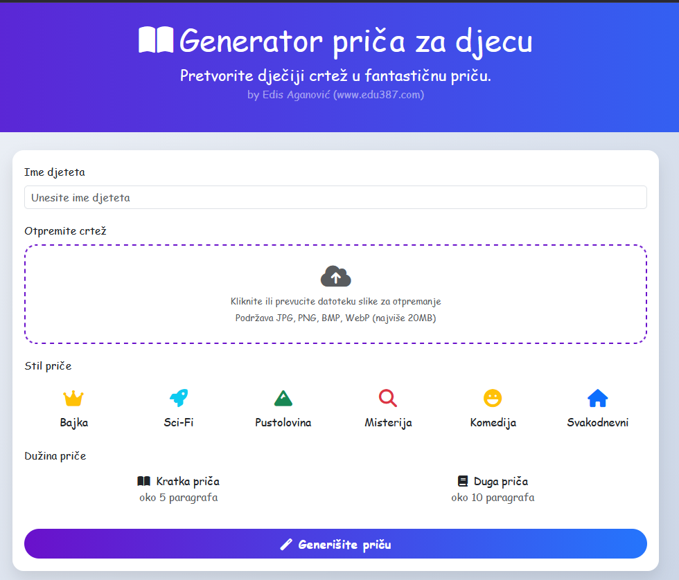
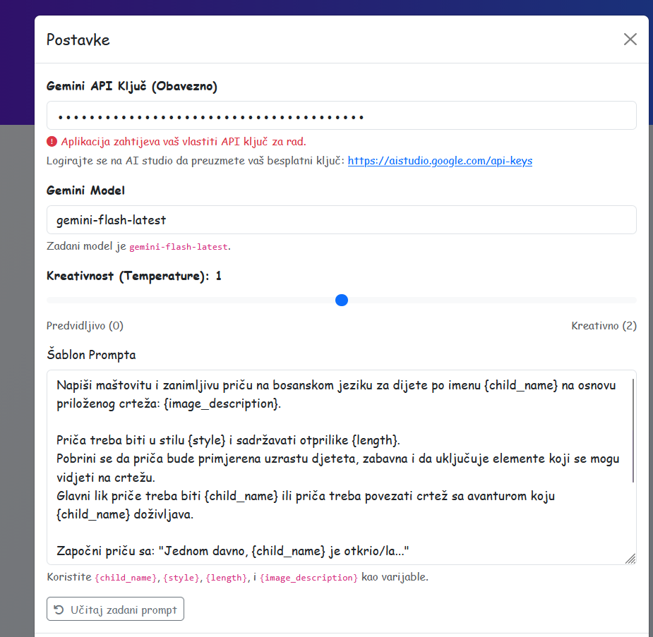

# Generator priča za djecu



Ovaj alat pretvara dječije crteže u fantastične priče koristeći Google Gemini API. Kreira personalizirane priče koje uključuju vizualne elemente sa slike, ime djeteta i željeni stil priče.

## Karakteristike

- 🖼️ **Analiza slike**: Prihvata JPG, PNG, BMP ili WebP datoteke.
- 👧 **Personalizacija**: Kreira priče sa imenom djeteta kao glavnim likom.
- 🎨 **Raznovrsni stilovi**: Nudi 6 stilova: Basna, Naučna fantastika, Pustolovina, Misterija, Komedija i Svakodnevni život.
- 📏 **Prilagodljiva dužina**: Izbor između kratkih (~5 paragrafa) ili dugih (~10 paragrafa) priča.
- ⚙️ **Napredna konfiguracija**: Mogućnost odabira Gemini modela, temperature (kreativnosti) i prilagođenih instrukcija (Custom Prompt).
- 🖥️ **Moderni UI**: Jednostavan i intuitivan web interfejs.

## Preuzimanje (za Windows korisnike)

Ako ne želite instalirati Python i ostale alate, možete jednostavno preuzeti gotovu aplikaciju (.exe) sa naše GitHub stranice:

👉 **[Preuzmi najnoviju verziju](https://github.com/EdisAganovic/ai-stories/releases/)**

Jednostavno preuzmite `.exe` datoteku i pokrenite je. Nije potrebna instalacija Pythona.

Za korištenje će vam biti potreban besplatan Gemini API ključ koji možete dobiti na [Google AI Studio](https://aistudio.google.com/).

## Preduslovi

- Python 3.7 ili noviji
- Google Gemini API ključ (možete ga besplatno dobiti na [Google AI Studio](https://aistudio.google.com/))

## Instalacija

1. Klonirajte ili preuzmite ovaj repozitorij.
2. Instalirajte potrebne zavisnosti koristeći `uv` (preporučeno) ili `pip`:
   ```bash
   uv pip install -r requirements.txt
   ```
   *Ili standardno:*
   ```bash
   pip install -r requirements.txt
   ```

## Korištenje

### Pokretanje aplikacije
Jednostavno pokrenite glavnu skriptu:
```bash
python main.py
```

Aplikacija će automatski pokušati otvoriti vaš zadani web pretraživač na adresi `http://localhost:8000`. Ako se to ne desi, ručno otvorite tu adresu.

### Generisanje priče
1. **Učitajte crtež**: Kliknite na područje za učitavanje ili prevucite sliku djetetovog crteža.
2. **Unesite ime**: Upišite ime djeteta.
3. **Odaberite stil**: Kliknite na ikonicu željenog stila priče.
4. **Odaberite dužinu**: Odaberite "Kratka" ili "Duga".
5. **Generiši**: Kliknite na dugme "Generiši Priču".

## Konfiguracija i postavke



Klikom na ikonicu zupčanika (⚙️) u gornjem desnom uglu otvarate meni sa postavkama:

- **API Ključ**: Ovdje unosite svoj Google Gemini API ključ. Ključ se čuva lokalno u `config.json`.
- **Gemini Model**: Možete ručno upisati naziv modela koji želite koristiti (npr. `gemini-1.5-flash`, `gemini-1.5-pro`).
- **Custom Prompt**: Ovdje možete definisati vlastiti šablon za generisanje priča ako želite specifičnu strukturu. Koristite `{child_name}`, `{style}`, `{length}` i `{image_description}` kao varijable.
- **Temperatura**: Klizač za podešavanje "kreativnosti" modela. Niže vrijednosti daju preciznije, a više vrijednosti maštovitije rezultate.

## Struktura projekta

- `main.py`: Glavna FastAPI backend aplikacija.
- `static/`: Sadrži CSS, JavaScript i slike za frontend.
- `templates/`: Sadrži HTML šablone.
- `config.json`: Lokalna datoteka za čuvanje postavki (kreira se automatski).

## Rukovanje greškama

Aplikacija će vas obavijestiti ako:
- Nedostaje API ključ.
- Format slike nije podržan.
- Dođe do greške u komunikaciji sa Google Gemini serverima.